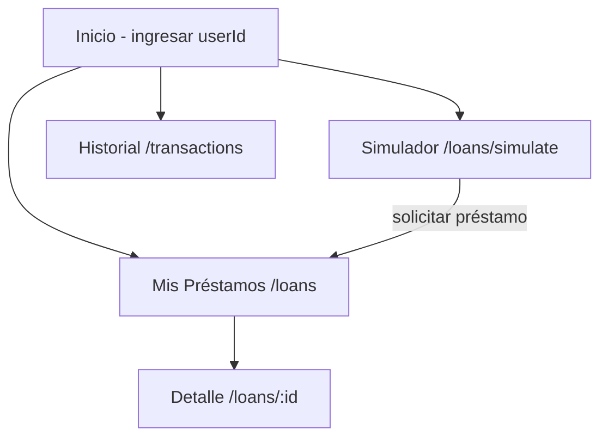
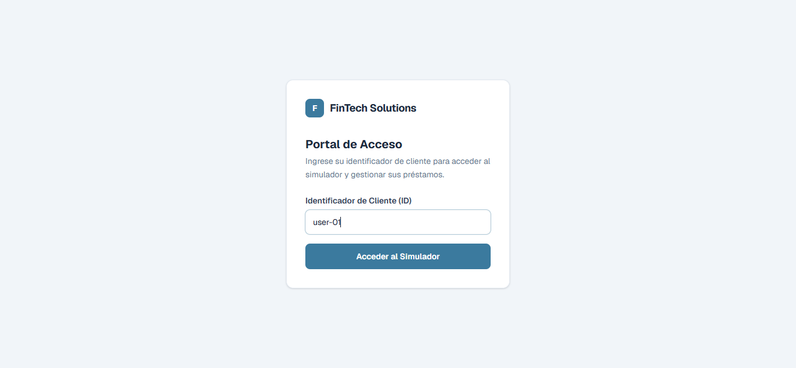
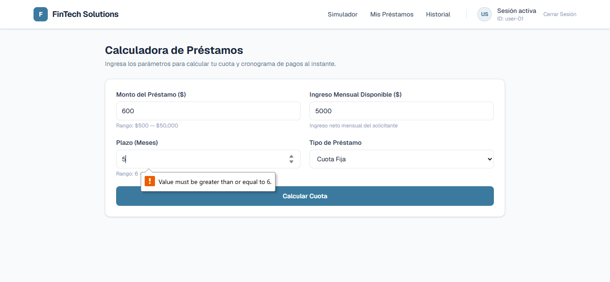
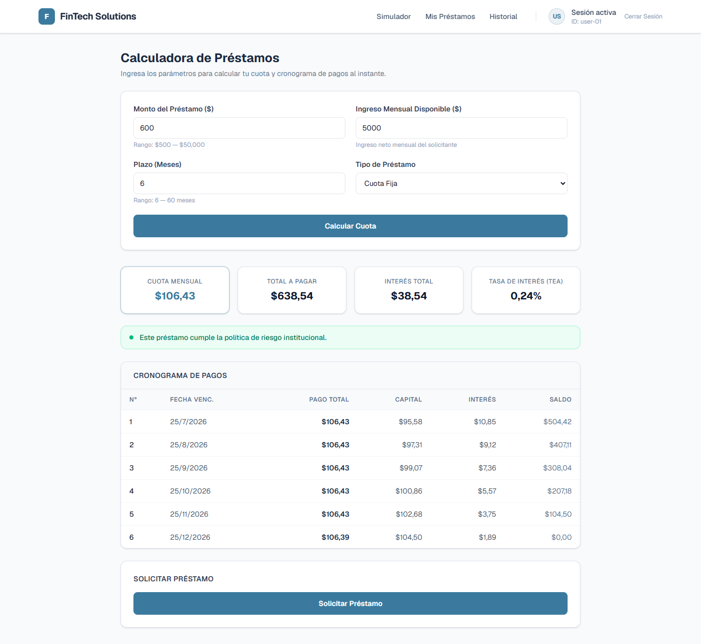
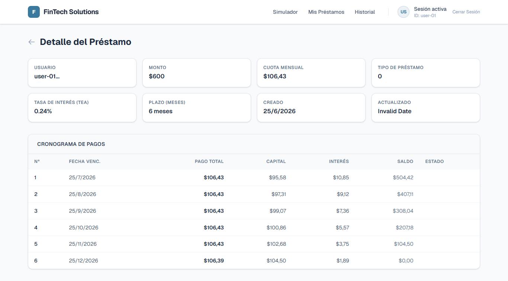
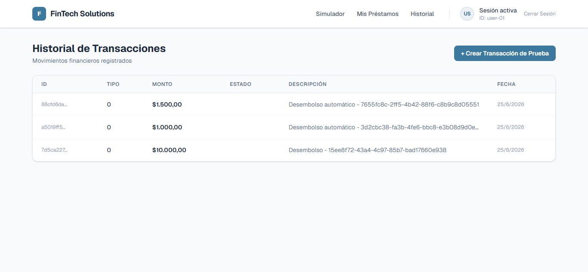

# SGIP - Frontend

Interfaz web para el Sistema de Gestión de Inversiones y Préstamos.

App: https://sgip-app.vercel.app  
API (Swagger): https://sgip-api-production-0877.up.railway.app/swagger/index.html

---

## Acceso

No hay autenticación implementada. La pantalla de inicio solicita un **Identificador de Cliente** que actúa como `userId` para todas las operaciones. Puede ser cualquier string, por ejemplo `user-01`, `user-5987`, `cliente-42`.

Los usuarios `user-01` y `user-02` tienen datos de prueba precargados (préstamos y transacciones).

---

## Tecnologías

- Next.js 14+ (App Router) / React / TypeScript
- TanStack Query — fetching, caché y estados de carga/error
- React Hook Form + Zod — validación de formularios
- Tailwind CSS

---

## Arquitectura

```
src/
├── app/
│   ├── page.tsx                   # Home / login por userId
│   ├── loans/
│   │   ├── page.tsx               # Lista de préstamos
│   │   ├── simulate/page.tsx      # Simulador + cronograma
│   │   └── [id]/page.tsx          # Detalle + cronograma
│   └── transactions/
│       └── page.tsx               # Historial de transacciones
├── components/
│   ├── LoanSimulator.tsx
│   ├── PaymentScheduleTable.tsx
│   ├── LoanList.tsx
│   └── TransactionList.tsx
├── services/
│   ├── loanService.ts
│   └── transactionService.ts
├── types/
│   ├── loan.ts
│   └── transaction.ts
└── lib/
    └── api.ts                     # Cliente HTTP base (fetch/axios)
```



---

## Correr localmente

**Prerrequisitos:** Node.js 18+

```bash
git clone https://github.com/accladeram/SGIP-APP.git
cd SGIP-APP
npm install
```

Crear `.env.local` en la raíz:

```env
NEXT_PUBLIC_API_URL=http://localhost:8080
```

```bash
npm run dev
```

App en: `http://localhost:3000`

Para apuntar al backend en producción:

```env
NEXT_PUBLIC_API_URL=https://sgip-api-production-0877.up.railway.app
```

---

## Evidencia

**Inicio — ingreso de identificador de cliente**  


**Simulador — validación de campos**  


**Simulador — cuota y cronograma calculados**  


**Detalle del préstamo con cronograma de pagos**  


**Historial de transacciones**  


---

## Limitaciones conocidas

- El campo "Tipo de Préstamo" en la vista de detalle muestra el valor numérico del enum en lugar de la etiqueta (`Fixed` / `Decreasing`).
- El campo "Actualizado" muestra `Invalid Date` cuando la API retorna `null` en `updatedAt`.